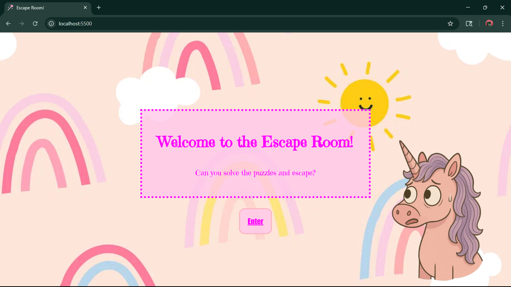

#Twinkle Trap - Escape Room : Hackathon Edition

Welcome to Twinkle Trap, the escape room that lures you in with sparkly unicorn cuteness — and then locks you in a nightmare. What begins as a pastel-hued game quickly turns dark when you wake up trapped in a creepy room full of unsettling surprises. Follow the twisted trail of hints, clues, and unsettling unicorn magic to free yourself... before the overlord of twisted unicorns drags you deeper into their glitter-coated nightmare. Will you escape the trap, or become just another glitter-stained victim?

-- Features --

- Fully immersive experience using audio clips and various interactive elements
- Intuitive navigation with navigation arrows, error pop ups, and custom cursor to indicate clue locations
- Semi-responsive layout for different computer screen sizes

-- Technologies Used --

- Html
- CSS
- JavaScript

-- How to Run the Project --

1. Download or clone this repository to your computer
2. Open in your browser with Live Server
3. Click on the Enter button to start the game

-- Walkthrough --

1. The enter button triggers the evil overlord wacking the user upside the head and knocking them out. User wakes up in room one - north wall to read a message taunting them (written by evil genius Russ Rapp).

<!-- TODO screenshot room with message-->

2. The user can find the first clue in the calendar (indicated by the magnifying glass on hover), the highlighted square is number 17. This will be used later. Arrows will help the user navigate to different parts of the room.

<!-- TODO screenshot room-->
<!-- TODO screenshot calendar popup-->

3. Assuming user clicks the right arrow, they will be taken to the east wall. This room has the next clue (indicated by the magnifying glass on hover), and other interactive elements.

<!-- TODO screenshot room-->
<!-- TODO screenshot unicorn blood splat-->

4. Assuming the right arrow is clicked, the user will be at the south wall where there is a door to exit. The door will not unlock until the user uses the clues (17 24) on the padlock

<!-- TODO screenshot room -->
<!-- TODO screenshot locked message-->
<!-- TODO screenshot padlock popup with one number thing open-->
<!-- TODO screenshot door unlocked-->

5. The user then can enter the door, which leads to the hallway. Thee doors have various interactivity when door handles are clicked.

<!-- TODO screenshot hallway-->

6. Using arrows for interactivity, the user can click the right arrow to go to the final room or the up arrow to go back into room one.

7. Assuming the right arrow is clicked, They go into the final room. The grate is indicated as a clue, but the user cannot interact with it as indicated in the error message (user needs a screwdriver).

<!-- TODO screenshot room-->
<!-- TODO screenshot error door-->
<!-- TODO screenshot error vent-->

8. The user will have to navigate back to room one - west wall to find the screwdriver (indicated by the magnifying glass on hover)

<!-- TODO screenshot room-->
<!-- TODO screenshot screwdriver location-->

9. User will navigate back to the final room to unlock the grate where they find the switch to cut the power

<!-- TODO screenshot vent off-->
<!-- TODO screenshot door message-->

10. The final page is the congrats page with a final message from the evil overlord

<!-- TODO screenshot -->

-- Challenges and Learning --

- Learning to work as a team through gitHub
- Creating interactive events through javaScript
<!-- TODO add more Russ challenges/learning curves -->

-- Credits and Resources --

- Calendar was made on canva
- Unicorns were ai generated and edited on canva
- Icons were from flaticon and vecteezy
- Sound effects are from pixabay
